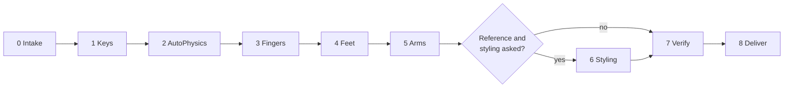

# Proposed Standard Workflow: Mocap Cleanup and Styling

A repeatable path from a raw captured clip to a delivered FBX, built from one full production run (a 986-frame dance clip captured from a 32.9 s video). Every stage has the same shape: **measure → change through a protected commit → re-measure the live scene → save under a new name**. Stages 1–5 are cleanup (remove capture errors). Stage 6 is styling (make the motion match what the performer meant) and needs a reference.

The agent-facing detail (exact arguments, pitfalls, formulas) lives in the [`cascadeur-mocap-cleanup`](../skills/cascadeur-mocap-cleanup/SKILL.md) skill. This document is the standard to follow and to review a run against.

## Ground rules

| Rule | Why |
|---|---|
| Never overwrite the source or an earlier result; save each accepted stage with `scene.save_as` under a new name. | Every stage can be compared and rolled back. |
| Check the active tab before every write, every save **and every final verification** (`scene_file(action="list")`). | A read from the wrong tab looks like lost work. |
| Only numbers re-read from the live scene count. A prepare's `predicted` values are a preview. | The rig, AutoPosing and interpolation change what was written. |
| Measure on every frame, write at keys. | A fast limb can cut through the body between two clear keys. |
| Look at the result (`mesh_sample` + `scripts/mesh_preview.py`), not only at metrics. | A metric at zero does not mean the pose reads right. |
| Fix classes of problems with one solve, not the spots someone points at. | Spot fixes leave sub-threshold residue and create new errors at their edges. |
| Keep the snapshot id of each commit until the stage is accepted; close stale working tabs every few commits. | Rollback stays possible; Cascadeur stays under a few GB. |

## Stages

| # | Stage | Calls (each write: prepare → `change_commit` → `interpolation_refresh`) | Gate to pass | Typical time (1000 frames) |
|---|---|---|---|---|
| 0 | **Intake** | `cascadeur_status`, `scene_file list`, `timeline_get`, `layer_list`; `motion_cleanup_analyze(checks=["feet","fingers","hands"])`; `motion_cleanup_analyze(checks=["arms"], every_frame=true)`. Ask for the reference video. | Build matches, pump alive, one character, baseline numbers recorded. | 8 min |
| 1 | **Key structure** | `feature_prepare("bake")` over the clip → `key_reduction_prepare(every_n=3, all layers)` → `feature_prepare("interpolation_range", interpolation="BEZIER")` | Keys every 3 frames on every layer; sampled transforms within ~1 cm of the bake. | 3 min |
| 2 | **AutoPhysics** | `change_prepare("auto_physics_enable")`, `change_prepare("auto_physics", "physics.auto_snap")` | `auto_physics_state` converged; body shift ≈ 2 cm, feet ≈ unchanged. | 5 min |
| 3 | **Fingers** | `feature_prepare("auto_posing_state", inactive, finger boxes)` → `motion_cleanup_prepare(kind="fingers")` → `kind="finger_fan"` when `gaps` is flagged | No joint with jumps > 10°/frame except deliberate flicks; index–middle gap median 2–6°. Skip when stage 6 will replace the fingers (`hand_pose`). | 4 min |
| 4 | **Feet** | `motion_cleanup_prepare(kind="foot_contacts")`; repeat while the mean drops by more than ~10 % | Mean skate < 0.4 cm/frame, p95 < 1.2, survey 0 double slides / 0 drags, `leg_over_cm` < 0.6. | 3 min per pass |
| 5 | **Arms** | `motion_cleanup_prepare(kind="arm_clearance")`; re-analyze `arms` on every frame; repeat once if a frame is left | 0 frames with an arm deeper than 0.3 cm inside the body (a single frame < 1 cm is tolerable). | 10 min per pass |
| 6 | **Styling** (optional) | In this order: `hand_pose` → `hand_rest` → `arm_clearance` → `wrist_soften` → `arm_clearance` if `arms` reports contact → bake the hand layer over the accent span → `wrist_accent` | Hands, wrists and contacts match the reference stills; wrists inside ±40° / ±22° unless the reference shows more; arms gate still passes. | 40 min |
| 7 | **Verify** | All four analyze checks again on the active tab; `mesh_sample` every frame; `mesh_preview.py` body and hand sheets; compare with reference stills at matching frames | Every gate above still passes after the last write; sheets reviewed. | 10 min |
| 8 | **Deliver** | `scene.save_as` (new name) → `close_working_tabs` → `change_prepare("export_fbx", "io.export_fbx", {"path": ...})` → `scripts/fbx_check.py` | FBX has one take, a key on every frame of every curve, the expected joints and mesh. | 2 min |

### Stage notes

**0 Intake.** For a clip captured from a video, `duration × fps = frame count`, so frame `f` is time `f / fps` and the video can be compared frame for frame. Note anything the performer wears or holds: mittens, gloves, props and sleeves are read as fingers and wrists.

**1 Key structure.** Do not use Animation Unbaking to thin mocap keys: it leaves `FIXED` intervals holding the raw data, and Bezier over its sparse keys moved the body by up to 76 cm.

**2 AutoPhysics.** Removes jitter (25–68 % in the reference run) and balances the centre of mass. It does not cure foot sliding or self-penetration, and neither do Fulcrum marking or Fix Collisions.

**4 Feet.** The first pass does most of the work (0.98 → 0.35 cm/frame); later passes return less (→ 0.18 → 0.16). What remains sits where a leg is already at full reach (a push-off): a placement problem, not a solver setting.

**5 Arms.** The surface is the skinned mesh, not the rig's collision capsules (capsules flagged 3 spans where the mesh showed 20). Run after the feet: the foot solve moves the whole body.

**6 Styling.** Decide from the reference, not from the data: what the hands are, where they rest, which bends are choreography. Order matters because every pass that moves the wrist or elbow changes the wrist bend: place the hands first, soften the wrists after, author accents last. `hand_fixed_closure` holds one hand shape when the reference shows one (0.85 = a paw-like loose fist). Time `wrist_accent` pulses from a per-frame signal read off the video.

**8 Deliver.** Cascadeur's FBX writer sets the file's global time span to one second while the curves carry the full clip; a DCC that trusts the global span shows a one-second timeline until its range is set to the take. Check with `fbx_check.py` and say so in the report.

## Acceptance summary

| Check | Source | Pass |
|---|---|---|
| Foot skate | `feet.skate` | mean < 0.4 cm/frame, p95 < 1.2 |
| Slides and drags | `feet.survey` | 0 / 0 (a < 1 cm double slide is tolerable) |
| Finger spikes | `fingers.joints[*].steps_over_spike` | 0, or deliberate flicks only |
| Index–middle gap | `fingers.gaps` | median 2–6° |
| Arms inside the body | `arms` with `every_frame=true` | 0 frames > 0.3 cm |
| Wrist bend | `hands.<Side>.wrist` | within ±40° flexion, ±22° deviation unless the reference shows more |
| Reference match (stage 6) | preview sheets vs. video stills | hand shape, contacts and accents read the same |
| FBX | `fbx_check.py` | 1 take, keys per curve = frame count, joints and mesh present |

## Files

- Work in the MCP's working copies; the user's files change only through `scene.save_as`.
- Name results `<clip>_clean_<stage>.casc` while stages are being accepted and `<clip>_clean_final_vN.casc` afterwards; deliver `<clip>_clean_final_vN.fbx` next to it.
- Keep the source and the latest result where the user works; move superseded drafts to the Recycle Bin (never delete permanently) once the user asks for a clean folder.

## Report template

1. **What was processed**: frame count, which stages ran, how many passes.
2. **Before / after table**: one row per gate, re-measured numbers only.
3. **What changed in the choreography**: steps inserted, body end position, hands moved onto the body, authored accents.
4. **Judgement calls**: hand shape, limits, spans treated as contact, anything taken from the reference.
5. **What remains and why**, with frame numbers.
6. **Files**: result scene, FBX, what was moved to the Recycle Bin.

## Reference run (986 frames, 30 fps, one character)

| Gate | Raw capture | Delivered |
|---|---|---|
| Foot skate mean / p95 (cm/frame) | 0.98 / 3.59 | 0.16 / 0.48 |
| Double slides / drags | 9 / 13 | 1 (0.3 cm) / 0 |
| Index–middle gap, left / right | 15.5° / 23.5° | replaced by `hand_pose` |
| Arm frames inside the body, left / right | 71 keys (8.0 cm) / 17 keys (3.3 cm) | 0 / 0 on every frame |
| Wrist flexion, left | −66° … +68°, deviation to 71° | −38° … +35°, deviation to 20° |
| Hands | half-curled, changing every frame | one paw-like shape, thumb wrapped |
| Left hand on the hip (frames 0–139) | 11.4 cm off the body | 0.6 cm |
| Intro "knock" (right wrist) | absent (constant −20°) | 9 beat-timed flicks |
| Timing vs. video | lag 0 | lag 0, same 1–3 Hz bounce power |
| FBX | – | FBX 7.7, 1 take, 1062 curves × 986 keys, 116 joints, 1 skinned mesh |

Lessons that shaped this workflow are recorded in the skill's [`pitfalls.md`](../skills/cascadeur-mocap-cleanup/references/pitfalls.md).
